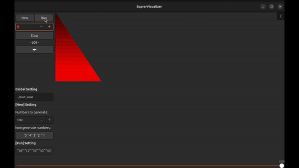
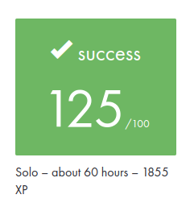

#  This project is part of my curriculum at School 42 

## Push_swap - Sorting Algorithms in C 📊

The **Push_swap** project challenged me to implement a sorting algorithm using a set of predefined operations on two stacks. The goal was to sort data with the fewest possible actions, optimizing both for performance and efficiency.

## 📋 Project Overview

The task was to create a program named `push_swap` that sorts a list of integers provided as arguments using a limited set of operations. This project introduced me to **sorting algorithms**, **data structures**, and the concept of **algorithmic complexity**—key topics for any software developer.

### Features

- **Stack Operations**: Manipulated data using a range of operations like `sa` (swap), `ra` (rotate), and `pb` (push).
- **Algorithmic Optimization**: Focused on minimizing the number of moves to sort a stack in ascending order.
- **Error Handling**: Managed input validation, ensuring all arguments are valid integers, without duplicates or exceeding integer limits.

## 🛠️ Operations Implemented

### Stack Operations
- `sa` – Swap the first two elements of stack `a`.
- `sb` – Swap the first two elements of stack `b`.
- `ss` – Perform `sa` and `sb` simultaneously.
- `pa` – Push the top element of stack `b` onto stack `a`.
- `pb` – Push the top element of stack `a` onto stack `b`.
- `ra` – Rotate stack `a` (move the first element to the bottom).
- `rb` – Rotate stack `b`.
- `rr` – Perform `ra` and `rb` simultaneously.
- `rra` – Reverse rotate stack `a` (move the last element to the top).
- `rrb` – Reverse rotate stack `b`.
- `rrr` – Perform `rra` and `rrb` simultaneously.

## 💡 What I Learned

- **Algorithm Optimization**: Understood the importance of minimizing complexity and choosing the best algorithmic approach for each scenario.
- **Sorting Algorithms**: Implemented and adapted sorting techniques to efficiently handle stacks.
- **C Programming**: Improved my skills in memory management and error handling, ensuring no leaks and handling various edge cases.

## 🛠️ How to Use

1. `make`
2. `./push_swap <list of numbers>` (without duplicate)

To use the visualiser like in the gif below : https://gitlab.com/nda-cunh/visualizer-push-swap

## 💯 Results

